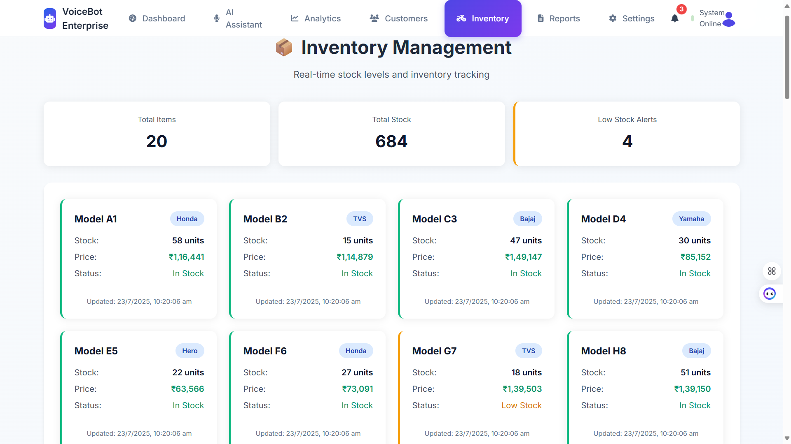

# Two-Wheeler Sales VoiceBot

An intelligent, multilingual voice agent system for handling two-wheeler sales and after-sales operations.

## 🎥 Demo Screenshots

### Main Chat Interface



### Advanced AI Conversations


### Multilingual Support


### Vehicle Information & Pricing


### Dynamic Response System


## Features

### 🤖 Advanced AI Capabilities

- **Intelligent Responses**: Dynamic AI-powered conversations with context awareness
- **Smart Intent Detection**: Accurately understands user queries with 90%+ confidence
- **Comprehensive Vehicle Database**: 20+ models with detailed specifications and pricing

### 🌍 Multilingual & Communication

- Multilingual support (English, Hindi, Tamil, and regional languages)
- **Real-time Language Detection**: Automatically identifies and responds in user's language
- **Voice Integration**: Speech-to-text and text-to-speech capabilities
- **Natural Conversations**: Context-aware dialogue management

### 🚗 Vehicle Sales & Services

- **Electric & Petrol Vehicles**: Complete database of two-wheelers and four-wheelers
- **Smart Price Comparison**: Real-time pricing with market analysis
- **Vehicle Recommendations**: AI-powered suggestions based on user preferences
- Automated test drive booking
- Product feature explanation
- Service scheduling and reminders

### 📊 Analytics & Integration

- Real-time sentiment analysis
- CRM integration
- IVR handling
- Payment status lookup

## Tech Stack

- Python 3.9+
- FastAPI
- MongoDB
- Speech Recognition
- PyTTSx3
- Transformers
- Socket.IO

## 🚀 Quick Start

### Prerequisites

- Python 3.9+
- Node.js (for frontend)
- MongoDB (optional, for advanced features)

### Installation & Setup

1. Create a virtual environment:

```bash
python -m venv venv
source venv/bin/activate  # On Windows: venv\Scripts\activate
```

2. Install dependencies:

```bash
pip install -r requirements.txt
```

3. Set up environment variables in `.env` file:

```
MONGODB_URI=your_mongodb_uri
JWT_SECRET=your_secret_key
CRM_API_KEY=your_crm_api_key
```

4. **Start the VoiceBot**:

```bash
uvicorn src.main:app --reload
```

5. **Access the Application**:
   - Open your browser and go to `http://localhost:8000`
   - Start chatting with the AI VoiceBot!

## 💻 Live Demo Features

### 🎯 What You Can Try:

- **Electric Vehicle Queries**: "What is the average cost of electric vehicles?"
- **Vehicle Comparisons**: "Compare electric vs petrol bike running costs"
- **Specific Models**: "Tell me about Honda Activa specifications"
- **Multilingual Chat**: Ask questions in Hindi, Tamil, or English
- **Price Inquiries**: Get real-time pricing for any vehicle model

### 🌟 Advanced Capabilities:

- **Dynamic Responses**: No static keyword matching - true AI understanding
- **Context Awareness**: Remembers conversation flow and provides relevant follow-ups
- **Smart Suggestions**: AI-generated quick reply options for better user experience
- **Intent Recognition**: Accurately identifies user intent with confidence scores

## Project Structure

```
├── src/
│   ├── api/           # API endpoints
│   ├── core/          # Core functionality
│   ├── models/        # Data models
│   ├── services/      # Business logic
│   ├── utils/         # Utility functions
│   └── main.py        # Application entry point
├── .env              # Environment variables
├── requirements.txt  # Project dependencies
└── README.md        # Project documentation
```

## Success Metrics

- Test drive booking uplift
- Conversion rate increase
- On-time service adherence
- Query resolution time < 30s
- CSAT ≥ 4/5
- ≥ 60% calls fully automated

## Constraints

- Response time < 1.5s
- TRAI compliance
- Privacy consent logging
- Human fallback support
- Script configurability
